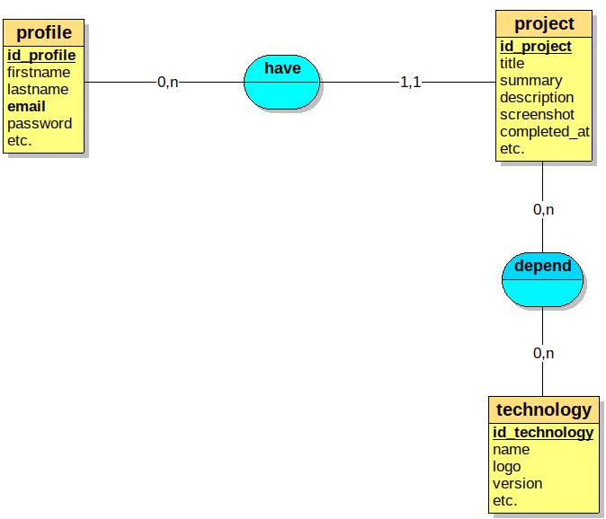
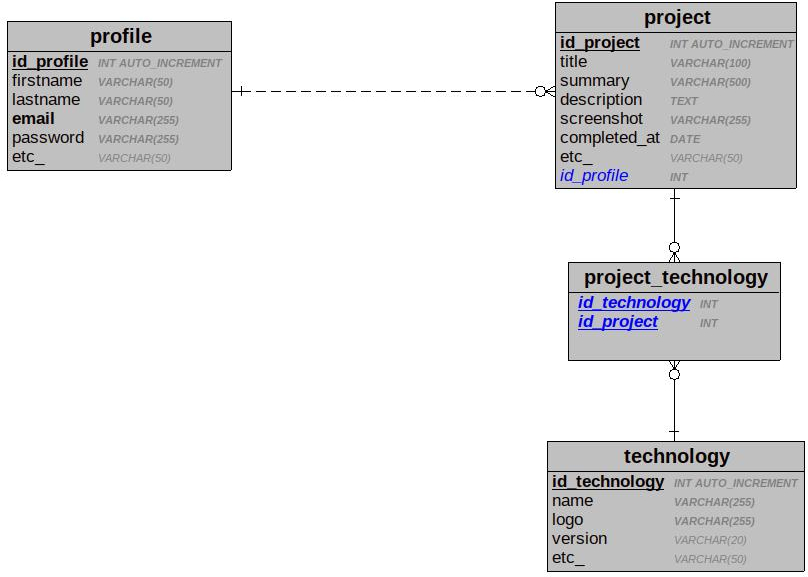

# Cyberfolio - Démo

<!-- TOC -->
- [Cyberfolio - Démo](#cyberfolio---démo)
  - [IMPORTANT : Notes préalables](#important--notes-préalables)
  - [Installation du projet](#installation-du-projet)
    - [Code source](#code-source)
    - [Base de données associée](#base-de-données-associée)
    - [Vérification de l'installation](#vérification-de-linstallation)
  - [Modèle Conceptuel des Données (MCD)](#modèle-conceptuel-des-données-mcd)
  - [Modèle Physique des Données (MPD)](#modèle-physique-des-données-mpd)
  - [Traitement des données entrantes (*input*)](#traitement-des-données-entrantes-input)
<!-- /TOC -->

## IMPORTANT : Notes préalables

- CRUD partiel (UPDATE à traiter) **uniquement sur l'entité `project`**
- Code volontairement très *« verbeux »*, voire *« naïf »*, afin de décomposer au maximum les différentes étapes pour assurer une bonne compréhension
- Code largement (trop) commenté afin d'assurer une bonne compréhension
- Présence de commentaires spéciaux :
  - `// FIXME:` Détails à implémenter en priorité
  - `// TODO:` Détails à implémenter d'ordre secondaire
- **Authentification et autorisations non implémentées** dans cette version (à vous de jouer)
- **Token CSRF non implémenté** dans cette version (à vous de jouer)
- Branche du dépôt GitHub par défaut : `develop` (dernière version à jour)
- La mise en forme du *back-office* s'appuie sur le *toolkit* [Bootstrap](https://getbootstrap.com/) pour ce qui est du CSS
- Quelques erreurs et/ou approximations doivent traîner : ne pas hésiter à me les signaler 

## Installation du projet

### Code source

Via la commande `git clone` depuis votre dossier de travail (*document root*), par exemple `www/` ou `htdocs/` selon l'environnement serveur utilisé :
```shell
git clone git@github.com:El-Profesor/Cyberfolio-Demo.git cyberfolio_demo
```

### Base de données associée

Depuis phpMyAdmin :
1. Création d'une base de données nommée `cyberfolio_demo` (avec interclassement `utf8mb4_unicode_ci`).
2. Sélection de la base de données `cyberfolio_demo` créée.
3. Via l'onglet **Importer**, import du fichier `cyberfolio_demo.sql` (dossier `fixtures/data/`) qui contient un jeu d'essai.

Dans le code source, ajuster les valeurs par rapport à votre serveur MySQL (plusieurs scripts PHP sont concernés) :
```php
$host = 'localhost';
$dbName = 'cyberfolio_demo';
$user = 'mentor'; // Your MySQL user username
$pass = 'superMentor'; // Your MySQL user password
```

### Vérification de l'installation

- *Front-office* : [http://localhost/cyberfolio_demo/](http://localhost/cyberfolio_demo/ "Accès au front-office")
- *Back-office* : [http://localhost/cyberfolio_demo/admin/](http://localhost/cyberfolio_demo/admin/ "Accès au back-office")

## Modèle Conceptuel des Données (MCD)

Ou *« schéma entité-association »* :



## Modèle Physique des Données (MPD)

Ou *« schéma relationnel »* :



## Traitement des données entrantes (*input*)

Idée générale :


